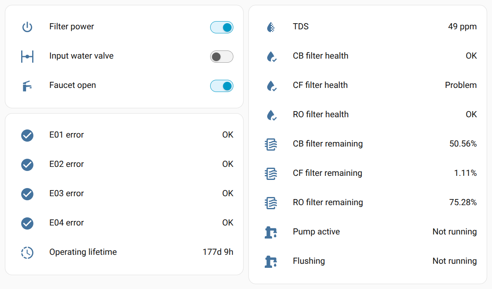

# waterdrop-esphome

Smarten Waterdrop RO systems: a plug-in Wi-Fi add-on board to integrate with Home Assistant, read hidden diagnostic parameters, and work around refrigerator line limitations.

See the story: [Hacking a water filter through a 7-segment display](docs/story.md).

> [!WARNING]
> Use at your own risk. This is not a certified retail product, but an open-source hacking hobby project.

## Features

- Reads sensors exposed by original RO unit
  - Water TDS level
  - Individual filter state: total and remaining life plus derivative sensors (life percentage, filter health warning)
  - Pump state (idle, active, flushing)
  - Error codes
  - Ambient air temperature
  - Last filter change time
  - [Potentially more](docs/reverse-engineering.md), as about fourteen 16-bit fields are still not reverse-engineered
- Simulates faucet handle position (see [Refrigerator line workaround](#refrigerator-line-workaround))
- Switchable power supply to the main RO unit
- Emergency water shutoff with external latching solenoid valve



### Refrigerator line workaround

Waterdrop RO water filter systems don't play particularly well with refrigerator water lines. After dispensing water from the refrigerator, the RO unit tends to switch to an erratic flush mode: briefly flushing every 5 minutes. This continues until water is dispensed from the original Waterdrop smart faucet.

The simulated faucet handle feature works around this issue. If the RO unit performs this flush attempt while the faucet is reported open, it will start a proper flush cycle and switch back to the regular 12-hour flushing interval.

## Installing firmware

### ESPHome Builder

Best for long-term maintenance.

1. Define the following secrets (ESPHome Device Builder 🡒 three-dot menu 🡒 Secrets):
   - common_api_encryption_key
   - ota_password
   - wifi_ssid
   - wifi_password
2. Create device 🡒 Advanced set up options 🡒 Empty Configuration; paste the following:
   ```
   packages:
     waterdrop-esphome:
       url: https://github.com/twasilczyk/waterdrop-esphome
       ref: main
       username: !secret github_username
       password: !secret github_token
       files:
         - firmware/builder-package.yaml
   ```
3. Install over USB at first, then you can switch to OTA
4. If installing for the first time, don't forget to enable power to the RO system - it controlls both power supply and serial communication (with faucet as well as the main unit)

### Local environment

Best for development (from terminal or VSCode).

1. Set up ESPHome through the [pip method](https://esphome.io/guides/installing_esphome/#pip)
2. `cd path/to/repo`
3. `ln -s "$HOME/path/to/your/esphome-venv" .venv`
4. Create `secrets.yaml` one directory up from your repo root:
   ```
   wifi_ssid: "YourWiFi"
   wifi_password: "..."
   ota_password: "..."
   common_api_encryption_key: "..."
   ```

Then, you can build from terminal:
```
cd firmware
esphome run waterdrop-esphome.yaml
```

Or from VSCode:
1. Ctrl+Shift+P
2. `Tasks: Run Task`
3. `ESPHome: Run without debugging`

## Electronics

### Bill of materials

| Ref | Qty | Value     | Product          | Total cost [$] | Optional |
| --- | --- | --------- | ---------------- | -------------- | -------- |
| C1  | 1   | 100µF/50V | 50YXJ100M8X11.5  | 0.43 | |
| C2  | 1   | 220µF/16V | 25YXJ220M6.3X11  | 0.31 | |
| C3  | 1   | 22nF      | CL21B223KBANFNC  | 0.10 | |
| C4  | 1   | 100nF     | CL21B104KBCNNNC  | 0.10 | |
| D1  | 1   | SMAJ30A   | SMAJ30A          | 0.22 | |
| D2  | 1   | B360A     | B360A-13-F       | 0.51 | |
| D3  | 1   | 1N4148    | 1N4148W-7-F      | 0.17 | Yes (relay) |
| F1  | 1   | 500mA     | 0PTF0078P + 0217.500MXP | 1.35 <!-- 0.78 + 0.57 --> | |
| J1  | 1   | DC5525 m  | PJ-002B          | 0.66 | |
| J2  | 1   | DC5525 f  | 10-02950         | 3.17 | Yes (relay) |
| J3  | 1   |           | Waterdrop        | 0.00 | |
| J4  | 1   | 5pin 2.54 | PH1RB-05-UA      | 0.15 | |
| J5  | 1   | 2pin 2.54 | PH1RB-02-UA      | 0.10 | Yes (valve) |
| K1  | 1   | SPDT 24V  | G5LE-1-E DC24    | 2.74 | Yes (relay) |
| L1  | 1   | 33µH      | 12RS333C         | 1.35 | |
| L2  | 1   | 1µH       | MLZ2012A1R0WT000 | 0.10 | |
| Q1  | 1   | BC817     | BC817-40-7-F     | 0.23 | Yes (relay) |
| R1  | 1   | 3.6k      | 0805             | 0.10 | |
| R2  | 1   | 1.2k      | 0805             | 0.10 | |
| R3,R11 | 2 | 10k      | 0805             | 0.20 | R3 (relay) |
| R4  | 1   | 47k       | 0805             | 0.10 | Yes (relay) |
| R5,R6,R9,R13 | 4 | 100k | 0805           | 0.40 | R13 (valve) |
| R7,R10,R12 | 3 | 51k  | 0805             | 0.30 | R12 (valve) |
| R14 | 1   | 1Ω        | 0805             | 0.10 | Yes (valve) |
| U1  | 1   | LM2596DS-ADJ | LM2596DSADJG  | 2.34 | |
| U2  | 1   | ESP32-S3-Tiny | [ESP32-S3-Tiny-Kit](https://docs.waveshare.com/ESP32-S3-Tiny?variant=ESP32-S3-Tiny-Kit) | 11.99 | |
| U3  | 1   | 74AHCT125 | SN74AHCT125QDRQ1 | 0.70 | |
| U4  | 1   | TB67H450A | TB67H450AFNG     | 0.85 | Yes (valve) |
|     | 34  |           |                  | 28.87 | 21.11 w/o |

### Inlet water valve

Inlet water valve is an emergency shutoff valve for inlet water in case other components of your smart home detected a leak. However, I haven't had much luck finding one exactly matching my requirements:
 - Latching/pulse/bistable, so it doesn't take constant load (if Normally Closed) or wouldn't unintentionally re-open water flow in case of power loss (if Normally Open).
 - 3/8" Push-Fit connection to match RO system tubing.
 - Ideally 24V, to directly accept RO power supply voltage.
 - Reasonably priced.

A close one is SDF-S209B-24V, priced at $3.65 - but requires two G1/2 to Push-Fit 3/8 adapters. **24V latching solenoids are the only supported type of external inlet valves.**
