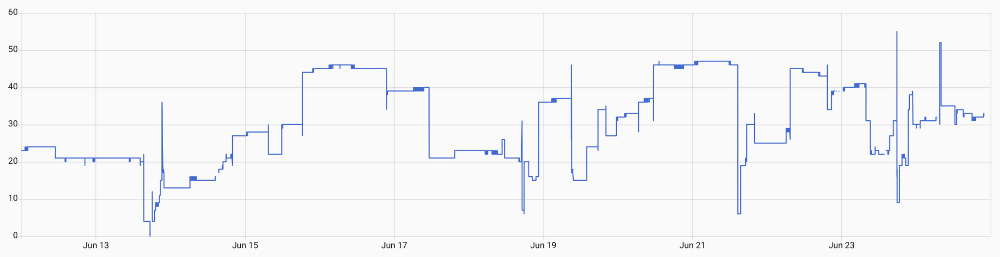
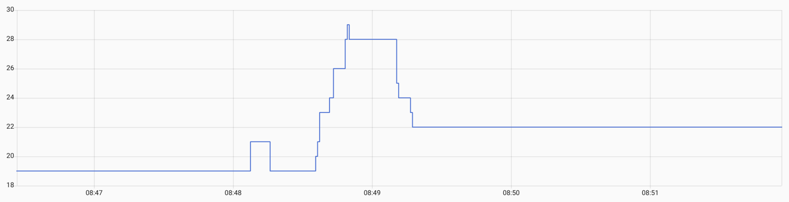

# Reverse engineering notes

Reverse-engineered protocol details are described in [message.h](../firmware/components/waterdrop_serial/message.h), but this document collects observations about partially reverse engineered values.

## MagicSensor1

\
<sup>MagicSensor1's 2-week log.</sup>

\
<sup>MagicSensor1's 5-minute close up.</sup>

Erratically updating value - clearly analog as shown in the close-up.
 - Normal range 4-46, but with occasional 0 and observed values as high as 53 (during mild winter).
 - Seems to update when dispensing water.
 - Looked like water pressure, but couldn't confirm it with measurements at nearby faucet.

## MagicCounter1

 - Increases by 10 every ~5min 22s after water flow problems (ejected filter, closed valve), but only 5 times.
 - After it rises 5 times during water flow problem, it stops and E03 error gets activated.
 - Some variants (`magicCounter1a` and `magicCounter1b`) drop when their respective filter is reset, others (`magicCounter1c` and `magicCounter1d`) drop when *any* filter gets reset.

## System state

System state events are spread between 3 fields:
 - `MessageC2::state`
 - `MessageC5Slot04::unknown1`
 - `MessageC5Slot04::unknown2`

I wasn't however able to precisely pin down all system operations to these bits.

### Observations

#### Idle
 - C2=FF, C5u1=FF, C5u2=F1

#### Filling glass with water (without pressure tank):
 - C5u2 doesn't change at all
 - First 3 seconds: C2 oscillates between F1 and FF with 650ms period
 - Then C5u1 joins, oscillating between F1 and FF with 2.5s period
 - However, when I cleared out "activity every 5 minutes", both started at the same time,
   oscillating slow once and then C2 continued fast and C5u1 slow.

#### Filling pitcher or glass with water (with pressure tank):
 - C5u2 doesn't change at all
 - Both C2 and C5u1 oscillate together (at the same time) between F1 and FF with 8s cycle

#### Activity every 5 minutes (with or without pressure tank):
 - C2 goes FF -> F7 -> F1 -> FF very quickly (unmeasurable in HA)
 - Variant A: C5u1/2 doesn't change
 - Variant B: C5u1/2 change to F7 for 2x the time C2 was not in idle (starting together with C2)
 - Variant C: C5u1 changes to F1 for 2x the time C2 was not in idle, C5u2 doesn't change
 - Variants change periodically (cycle is 5 minutes):
   - Variant A runs for 2 cycles after water use or 9 cycles (but sometimes 6, first time after
     water use) after Variant C
   - Variant B runs for 3 cycles after Variant A
   - Variant C runs for 5 cycles after Variant B (but sometimes 8, first time after water use)
 - I was able to clear this by claiming "the faucet is open", so there was no activity for the
   next 8 hours until the next use. But switching to this state doesn't clear it alone - it has
   to happen right before the 5-minute activity. Then, it triggers pump for 1 minute.

## Air temperature:
It's present in 4 fields that looks the same. But then why is it twice in `MessageC5Slot05`?

## Other slots

Original faucet requests slots in the following order:
0x0D, 0x01, 0x0E, 0x0F, 0x03, 0x02.

RO system responds to other slots though:
 - 0x05: `00 00 00 xx 00 00 00 00` with often changing xx byte
 - 0x07: constant `00 00 00 00 00 00 00 00`
 - 0x10: constant `00 00 00 00 00 00 66 22`
 - all others: `01 00 00 CA xx xx xx yy`
   - xx are the same as in last transmitted C5 frame payload
   - yy is that frame's checksum

## Buffer overrun in the faucet

TDS display is transmitted as 16-bit unsigned integer, but only values 1-999 are displayed
directly. Values 03E8 (1000) to 270F (9999) are displayed without trailing 2 digits as F-codes
(e.g. 1000 as F10, 2500 as F25, 9999 as F99). Values for the next 6 thousands are using
hexadecimal digits for the first digit only (e.g. 10000 as FA0, 11500 as FB5, 15999 as FF9).
Values between 16000 and 65535 span beyond the lookup table, allowing to dump the next 49 bytes of
EEPROM/Flash (50 bytes including the trailing padding null byte of 7-segment glyphs table).

Useful tool to encode 7-segment display to bytes:
https://jasonacox.github.io/TM1637TinyDisplay/examples/7-segment-animator.html

Dumped memory layout (please note MSB is unknown due to missing dp segment in the display):
```
// Regular glyphs table (starting with 1 through F, nul terminated)
06 5b 4f 66
6d 7d 07 7f
6f 77 7c 39
5e 79 71 00

// Registers lookup table
01 01 00 26 (or A6)
02 01 00 2e (or AE)
03 01 00 53 (or D3)
07 01 00 5b (or DB)
0d 01 00 36 (or B6)
0e 01 00 3e (or BE)
0f 01 00 46 (or C6)

# Lookup table for slot numbers to request
0d 01 0e 0f
03 02

# Unused (likely FF, not 7F).
      7f 7f
7f 7f 7f 7f
7f 7f 7f 7f
7f 7f 7f 7f
7f
```

For registers lookup table, the first byte is slot number (same as in the lookup table) and last byte is value with unknown MSB. It's unclear if this is Lookup table (constant in Flash) or configuration (modifiable in EEPROM).
