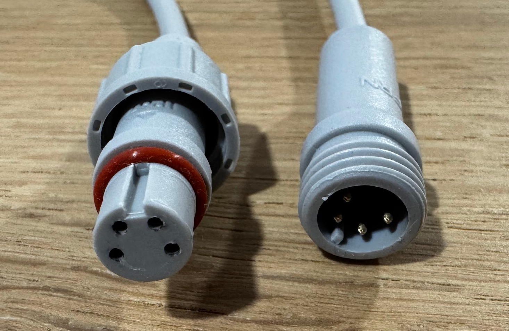
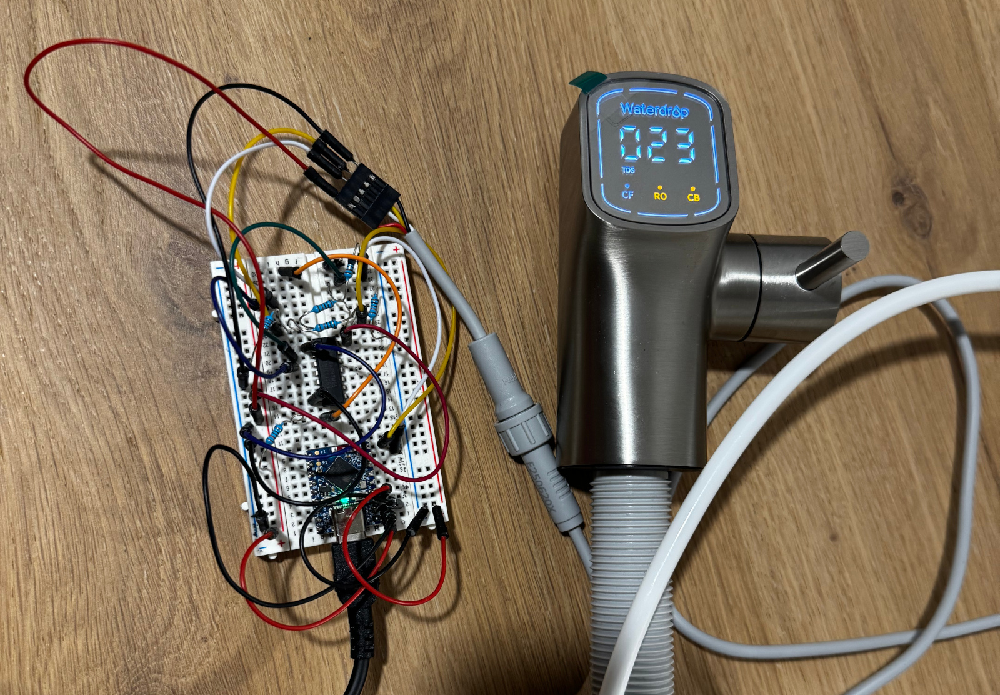
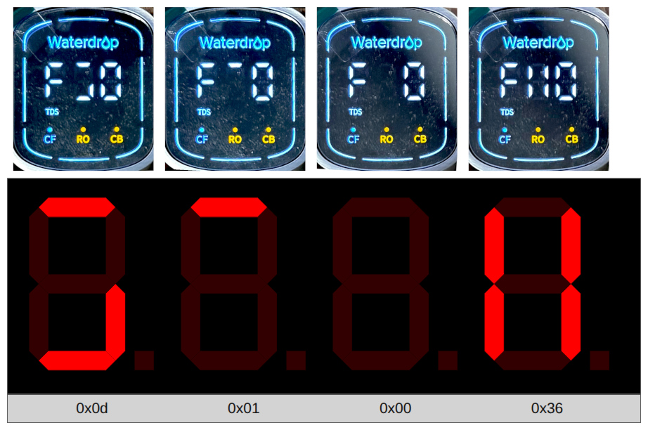
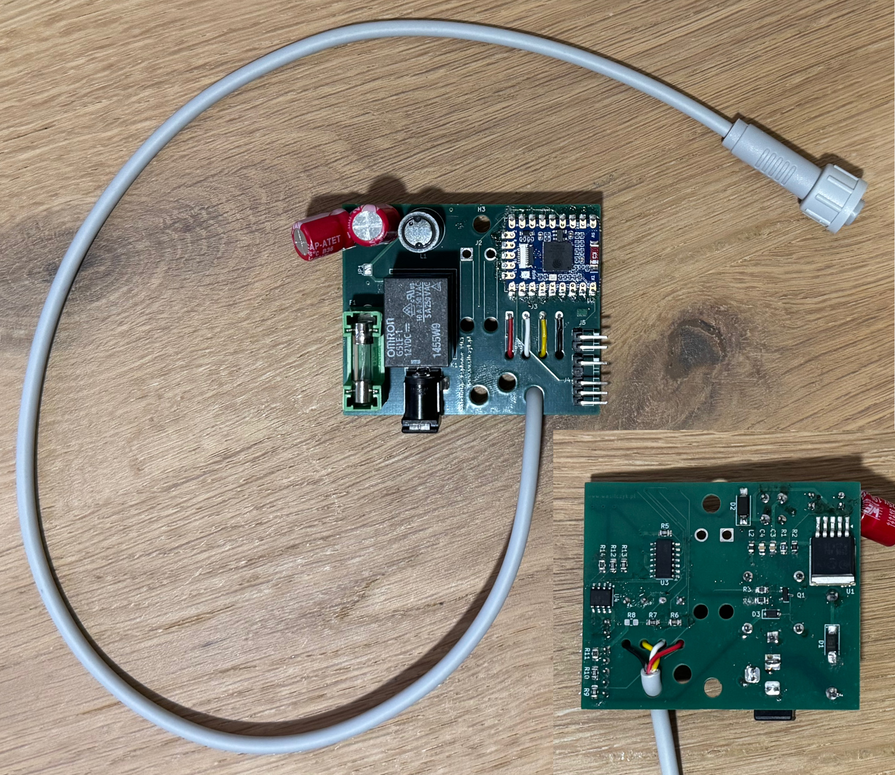
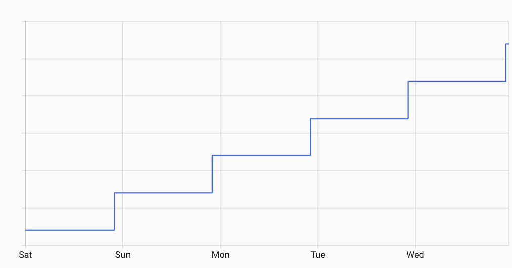

# Hacking a water filter through a 7-segment display

It's a catchy headline, but that's pretty much what happened: I took one of the most boring appliances in the kitchen and squeezed some interesting discoveries out of hacking it.

> [!TIP]
> If you happen to own a Waterdrop RO water filter system and want to smarten it and maybe do some reverse engineering, all you need is $25 worth of parts and basic soldering skills (or just ask a PCB fab for assembly). Everything you need to get started is in the [fully open-source GitHub project](https://github.com/twasilczyk/waterdrop-esphome).

When I ordered my Waterdrop G3P600, the first thing that caught my attention was a "smart faucet" with a 7-segment display, connected to the RO unit with a 4-pin connector. The practical reason to control it was that I wanted to install the system in the basement and still get information on my phone. But really, I needed to scratch that reverse-engineering itch and wanted to put that new somewhat professional-looking (read: not looking like Arduino) ESP32 module to some use. The first obstacle was an uncommon connector, but Waterdrop generously offers a 1-meter extension cord free of charge. That's enough for two connectors: one for the RO unit, the other for the faucet side for future pass-through support. Alternatively, one could simply cut the faucet's original cable and replace the original connector with a 5-pin dupont plug connected directly to the ESP32 board.

\
4-pin faucet connector.

After a few quick voltage measurements and dumping some transmissions with my trusty Saleae, the 4-pin connector turned out to have very straightforward characteristics: 5V power and ground, plus a 9600-baud serial connection. What I didn't measure, and what would bite me later, was the power supply I was planning to parasite from - it was 24V instead of the 12V I assumed. The protocol seemed simple, but not as simple as one could expect for controlling a few 7-segment digits and half a dozen extra LEDs: there were three different frames going out of the RO unit and one frame from the faucet. The first and last would always be there, while the middle one would only show up when the faucet was connected.

\
Breadboard prototype.

One of the reasons I started this was to evaluate how useful AI would be for a hobby project - so the first task was to make something out of the protocol. I dumped the transmission from the logic analyzer and fed it into an AI chatbot. The thing immediately figured out the frame structure, quirky checksums, and request-response protocol. Then, using a breadboard prototype (big words for an ESP32 devboard plus a logic shifter), I asked AI again to replicate this protocol in ESPHome YAML - another hour or two saved, especially for throwaway test code.

The first phase of protocol reverse engineering was all about controlling the faucet display on my desk. Simply replaying frames recorded from the original transmission made it light up - as long as the faucet was in the "open" position. I was able to quickly find the bytes responsible for the 7-segment TDS (water quality) display and make it count up from 1 to 999. But two bytes can encode much larger values, can't they? Turned out that higher numbers are displayed as "F-codes" without the trailing two digits, where F10 represents TDS 1000 and F99 means 9900-9999. But this is not the full 16-bit range, is it? Indeed, the next 6 thousand values turned out to be a weird form of *hex*-coded-decimal (FA0 for 10000 up to 15999 for FF9). But how about even higher numbers? At this point, TDS of 16000 ppm would be worse than sewage (up to 1100 ppm) coming out of your drinking water faucet, closer to seawater (about 35000 ppm).

\
*Garbage* display output for TDS values in the 33000-36000 ppm range.

Turns out, TDS values beyond 16000 show garbage glyphs. Or is it garbage? Driven by too much curiosity, I found some online "7-segment display calculator" to visually encode segment displays into numbers (often used to drive a display's abcdefg pins). I was able to map out all possible segment combinations by setting all 65 different "thousand" values and painstakingly keying shapes into the online calculator and noting down the results. What I saw wasn't garbage - it was the exact order in which the faucet was requesting frames I had seen in the live protocol before! Moreover, these numbers appeared again in some kind of registry with magic values, also showing one more slot number that didn't appear in the protocol at all. After all, it looks like the TDS display was using Flash or EEPROM as storage for decimal glyphs, not checking if the value being shown isn't out of the usual range - causing a typical buffer overrun (see *Buffer overrun* at the end of [NOTES](../protocol/NOTES)).

\
Mostly assembled PCB with a few mistakes to fix.

It was time to verify all of these protocol assumptions with the other side - the RO unit. But replaying frames in YAML wouldn't cut it, since now we had to analyze the filter state. By that time my first PCB prototype had arrived from China, so I was able to loop back the simulated RO filter signal into the newly implemented faucet simulator. It worked on the first try! But don't be fooled - yes, while it took me 10 minutes to generate the first *fully working* iteration of the C++ implementation, it still took another couple evenings to refine this rather short code to my liking. I must say AI is very good at generic code and digging deep into framework documentation, but falls short when you want something very specific - like the protocol representation I made in [frame.h](../firmware/components/waterdrop_serial/frame.h) and [message.h](../firmware/components/waterdrop_serial/message.h).

\
Unknown sensor increasing by 24 every 144<em>5</em> minutes.

Finally, I made a leap of faith and tried connecting the board to my RO unit. One blown fuse later (remember I forgot to measure the power supply?) I got it talking to me! Unfortunately, AI isn't magic and it wasn't able to figure out what the filter unit was saying, but Home Assistant came to the rescue. My trick was to represent all magic fields as integer sensors and let HA draw history graphs of their values. With a couple days' worth of graphs and some back-and-forth checking my findings on the faucet display, I was able to find some expected readings: individual filter remaining health, total filter life (no idea what the unit is though), kinda when it runs the pump, and even something that looks like water temperature. One sensor caught my attention: it was changing once a day. And every day it goes up by a value of 24. Right! It's the total running hours for the filter since I bought it. But wait... it doesn't increase every 24 hours, but every 24 hours and 5 minutes! That drift is small at first, but after a year it will be wrong by over a day. What's notable is that this clock would roll over after about 7 and a half years - I hope the manufacturer didn't assume their product wouldn't last that long.

\
Reverse-engineered properties of the system.

Eventually, I decided I had already spent more time on this project than anticipated, but also achieved more than expected. There's still tons to discover here - including low-hanging fruit like figuring out the exact meaning of the filter status fields, mapping some analog sensors (it would probably help to open the RO unit and see what sensors are there), and hooking it to more advanced units with more filters and faucet buttons. If you want to dip your fingers into this fun puzzle set, you just need to order a PCB from your favorite cheap fab (I paid a total of $6.19 for mine) and $18-$25 worth of components from your favorite supplier to mount on it.
